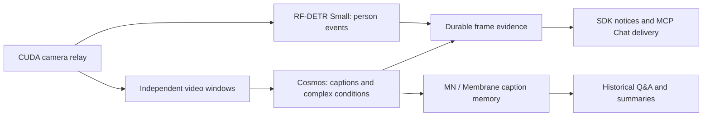

# CCTV Operator

`Blueprint ID:` `cctv_operator`

`Category:` `Security`

`Runtime:` `NVIDIA worker; constraint-routed to Spark in a Mac + Spark cluster`

CCTV Operator is a stream-only live monitoring service with a self-contained
demo stream and support for one approved external RTSP/RTMP source. This release
puts the looping test video, MediaMTX server, FFmpeg publisher, workflow
executors, report writer, and Web UI inside DockerWorkers, so
the default demo needs no camera URL or host-side media tools. Its read-only
operations console serves a CUDA-assisted MJPEG preview and server-sent operator
events without exposing the camera URI to the browser. Visual analysis
uses Cosmos3 for sequence understanding and risk forecasts, with Markdown context
memory for chat. Nemotron 3.5 Lightning handles text chat.

The default host output folder is `~/Downloads/cctv-operator`. New runs copy
their review artifacts there and OtterDesk opens that same folder.

## Source contract

The default `video_source.profile=bundled_demo` stages `video_source.demo_file`
(`/Volumes/128GB/videos/nv-warehouse-4cams/Camera.mp4`) from the submitter, then starts MediaMTX and a looping
sample publisher inside the DockerWorker, then monitors
`rtsp://127.0.0.1:8554/cctv-demo`. Launch validation recognizes this explicit
profile and leaves its reachability check to the worker that owns it.

The long-running Web UI service starts and owns the demo publisher. Sampling
ticks wait for the stream; they never start it. Runtime cancellation stops the
publisher with the service, while completing a sampling tick leaves it running.

For a real camera, set `video_source.profile=external` and set
`video_source.uri` to one reachable `rtsp://`, `rtsps://`, `rtmp://`, or
`rtmps://` URI. External file and folder sources are rejected; the demo file is explicitly staged for stream playback. The Web UI relays this
server-side source as MJPEG, so browsers never receive the RTSP/RTMP URI or its
credentials.

If the stream server runs on the Mac that submits the job, do not enter
`rtsp://127.0.0.1:8554/live`: the NVIDIA worker would look for that address
on its own machine. Bind the stream server to a network interface and use the
Mac's LAN address in setup, for example `rtsp://<mac-lan-ip>:8554/live`.
The server must accept connections from the NVIDIA node. The `rtsp-server`
used for local testing supports `-H 0.0.0.0`; verify the resulting LAN URL
from the NVIDIA node before starting CCTV Operator. Mac-side launch validation
rejects local-only external stream addresses before a workflow is submitted.

## Independent detection and captioning

Version 2.0 uses one resident camera relay and three independent lanes:



RF-DETR Small runs in the long-running video service at a requested 5 FPS. Two
consecutive confident person samples start a scene-presence episode. Two seconds
of sampled absence rearm it; missing frames cannot prove exit. The default
presence goal publishes a notice directly from this detector, without waiting
for Cosmos, memory or a workflow tick. Confidence and the 120-second notice
cooldown still apply. This is scene presence, not person identity or tracking.
Complex instructions such as a falling person or a blocked corridor use Cosmos.

Caption sampling runs in a separate thread at 4 candidate FPS, with a rolling
four-second window and a ten-second baseline cadence, including quiet scenes.
Each admitted window selects at most twelve non-duplicate chronological frames.
Core delivers durable batch references to the existing caption worker. There is
one batch in flight and one latest pending window; replaced windows are counted.
An on-demand instruction keeps its revision while waiting. Caption completion
is durable, errors release admission, and missing completion is shown as stalled
rather than starting overlapping requests. At most six admissions per minute
and the existing single Cosmos slot bound model load.

Slow or failed captioning leaves person detection running. A failed detector is
reported separately and leaves caption sampling running. Person goals never
produce a second notice from Cosmos; superseded complex-goal captions remain
history but cannot notify under the new instruction. Playback does not wait for
model readiness. `get_operator_status` exposes both lane states.

## Sampled understanding and risk memory

Every scheduled caption sequence is analyzed, including quiet scenes and batches
with no configured-target match. A condition check or approval does not block the
scene account. Cosmos records observed activity separately from `risk_predictions`.
Each prediction includes visible evidence, a qualitative time horizon, confidence,
severity and recommended human review. Predictions are hypotheses, not observed
incidents or a guarantee of safety. Consequential actions remain human decisions.

The detector reads three complete previous Markdown accounts for the same camera
and source, then publishes its new typed Facts/Relations/account through Membrane.
Capture start/end times, instruction revision, batch reference and uncertainty
survive across runs in Job-scoped memory. No raw images, source credentials or
private model reasoning enter that memory. Default admission is 49,152 bytes;
insufficient capacity is explicit and complete records are never silently cut.

Chat uses `get_operator_status` for current understanding and predicted risks,
and `get_video_history` for up to twelve complete historical accounts, optionally
bounded by timezone-qualified `after` and `before` times. Use an earlier `before`
for another page. Answers retain times and evidence references and disclose the
bounded result. Prepared hourly Markdown (split into additional files at 4 MiB) under Job output
`context_sources/outputs/` supports cited answers when the monitor is stopped.
Runtime receipts stay in `runtime_memory/`. The prepared source connection has
explicit SDK inventory/corpus limits (512 files, 4 MiB per file, 32 MiB total);
a capacity error must be reported rather than claiming exhaustive history.

The design follows Spark VSS's short-sequence temporal analysis, while composing
it with MirrorNeuron's existing sampler, memory and chat rather than deploying
VSS's complete service stack. See the [NVIDIA Cosmos API](https://docs.nvidia.com/nim/vision-language-models/1.7.0/examples/cosmos-reason3/api.html).

Monitoring steering persists only for the current run. The external OtterDesk
chat AI sends the declared `steer_monitoring` live input over the blueprint MCP;
the dashboard is intentionally read-only. Each update receives a command ID and
instruction revision so reports identify the instruction used for a batch.

For example, send **“can you focus on find foreign object on the floor?”** in
Chat. The monitoring action applies that goal and requests a fresh analysis.
Subsequent vision prompts use that goal in place of the default people/activity
targets. Ask to clear the monitoring instruction to restore configured targets.
A queued command is not yet an applied goal; an already-running analysis can
still finish with its earlier instruction revision.

The response declaration includes tool descriptions for chat intent selection.
Deploy the updated SDK common and job-response packages together with this
blueprint, then reload the Job definition and start a new run to use the updated
worker prompt. Updating source files alone does not change an installed run.

## Runtime requirements

The manifest declares a hard NVIDIA CUDA requirement with one GPU and at least 49,152 MB of GPU or unified IGP memory. Eligibility, including DGX Spark unified-memory accounting, is enforced by `mn-python-sdk`; the blueprint does not duplicate that detection logic. There is no CPU or Mac-only execution path.

All executable CCTV components use SDK-managed
`MirrorNeuron.Runner.DockerWorker` containers on the selected NVIDIA node. The
sampler owns the exclusive GPU allocation; ingress, detector, and report writer
reuse that GPU-enabled container. The Web UI also runs in that shared
host-network DockerWorker. The generic Web UI skill binds an OS-selected free
port, and the browser reaches it through the standard job-scoped Web UI proxy without a
host-side UI process or a second transfer of the bundled video. In bundled demo
mode, the shared media container starts the pinned
MediaMTX server and loops the staged warehouse recording with FFmpeg before sampling begins.
Reusable capture, scene
scoring, selection, and batch persistence mechanics come from
`mirrorneuron-live-video-analysis-skill`; the blueprint retains CCTV steering,
detection, alert, and report policy. The vision model is the blueprint-owned `cosmos3-nano-reasoner:1.7` Docker/NVIDIA NIM
backend (`source: docker`), served through the selected node's managed LiteLLM
route. Its full `model_spec` is declared in `execution.json` and transferred
through the SDK custom-model contract. Catalog absence and compatibility
findings warn without blocking installation; malformed definitions and actual
installation failures remain errors. The runtime owns install/start/stop/unload; the blueprint does not run NIM
installation commands. First installation requires `NGC_API_KEY` (or
`NGC_CLI_API_KEY`) in the owning runtime's environment. Keep it out of blueprint
config and chat. The existing `nemotron-3.5-lightning:latest` DMR model remains
the text chat model and is reused when installed. Cosmos uses temporal
`video_frames`, reasoning and a 4,096-token output budget; private reasoning is
excluded from memory. Missing, malformed or truncated final answers are explicit
analysis failures, never fabricated clear-scene observations.

Deploy the matching SDK and video-skill packages before launching this revision.
The SDK, models and RAG component minima are `1.3.58.dev45`; the video skill
minimum is `1.3.58.dev12`. These versions provide blueprint-owned model recipes,
generic embeddings, and the temporal-frame contract.
The MCP and Job response components require `1.3.58.dev43` or later for event
images, newest-record cursors and complete bounded read summaries. These source
changes must be included in the deployed SDK packages; older workers must be
restarted with the updated blueprint and dependencies.

## Web UI

The blueprint owns a DockerWorker `cctv_web_ui` service and its browser page.
It claims the bound service through `mn-python-sdk-web-ui`, which only
writes the durable iframe-proxy handle. It shows:

- a stable multipart MJPEG preview produced by one shared FFmpeg relay using
  CUDA decode and `scale_cuda` inside the NVIDIA DockerWorker;
- `latest_analyzed_frame.jpg`, refreshed when a new analysis completes.

The embedded page contains only these two media panels. The conversation receives
reviewable notices only when the monitoring goal matches and passes the configured
confidence and cooldown policy. Each notice gives the observed capture time and
attaches the model-selected evidence frame. Quiet scenes and unrelated activity
produce no Chat messages. Evidence previews are bounded JPEGs (75 KiB), stored
immutably per event and carried through SDK MCP activity delivery. Changing the active goal resets the prior goal's notice cooldown, so
the first qualifying finding for the new goal can appear promptly in chat. The
web UI link is published after its preview has produced a video frame.
SSE updates the snapshot without duplicating the activity feed in the page.

The UI exposes no steering form or browser action. External chat/MCP clients use
the manifest-declared `steer_monitoring` live input; callers still cannot name
physical agents or routes. The UI process opens the configured stream once and
fans its MJPEG frames out to connected browsers. FFmpeg uses CUDA hardware
decode and resize; because NVIDIA FFmpeg does not provide an MJPEG NVENC codec,
the final JPEG entropy encoding uses FFmpeg's MJPEG encoder. There is no CPU
decode fallback. Camera credentials remain server-side and are redacted from
browser URLs, events, and errors. The service derives conversation observations
and their supporting measurements from the durable report and latest-frame
artifacts. Each observation carries its own confidence and risk, rather than
borrowing values from the newest frame. It does not depend on a per-service
`events.jsonl` mirror. The default
`web_ui.service.port` value is `0`.
The generic Web UI skill resolves a runtime-reserved port when one exists;
otherwise CCTV binds port `0` and claims the actual OS-selected port. CCTV does
not maintain a port range or allocator.
The sampler durably writes the current run-scoped instruction to
`monitoring_state.json`, which the dashboard uses as its authoritative watch
target instead of depending on transient event relay files.

When the workflow is scheduled on a remote GPU machine, ingress, analysis,
report writing, and the dashboard stay in DockerWorkers on that same CUDA node.
The UI's dedicated container shares the runtime artifact volume with the media
worker, avoiding a cross-node read of a node-local frame batch. A
wildcard UI listener uses the worker's execution-node address when it writes
the private upstream into `web_ui.json`. The browser opens only the stable
`http://localhost:55173/jobs/<job_id>/ui` route and never navigates to the
worker address or allocated port.

## Constraint-based federated placement

The manifest uses `single_node`, constraint-based placement. Spark is the only
eligible job owner in a Mac + Spark federation because it is the only node
meeting the required NVIDIA CUDA GPU capacity. The SDK therefore forwards the
whole job to Spark's Core and pins the sampler, detector, report writer, and UI
there. This gives the long-running dashboard and workers one authoritative
run-artifact directory while the Mac remains the control plane.

The special multimodal model is lazily installed on first detector use. Its
preparation progress is shown in the run activity. To inspect the completed
installation on Spark:

```bash
ssh spark 'docker model ls'
```

The runtime catalog registers Cosmos3 as a managed Docker/NIM vision model and
Nemotron 3.5 Lightning as the separate DMR chat model.

For a Mac-primary + Spark deployment, each federated Core must have its own
writable Redis coordination store. Start an independent runtime on Spark, then
add it from the Mac using the token printed by Spark:

```bash
# On Spark
mn runtime start --host <spark-ip>

# On the Mac
mn node add <spark-ip> --token <spark-runtime-token>

mn node list
mn resource show
mn blueprint run ./cctv_operator --web-ui
```

Do not point Spark at the Mac's Redis. Federation requires distinct store
identities, and `mn node add` rejects two runtimes that share one. `mn node
list` must show the Mac and Spark as healthy, and `mn resource show` must show
Spark's NVIDIA/CUDA device before launch.

The cluster token is a secret. Pass it only to the runtime and join commands;
do not store it in blueprint config, logs, or reports.

The submit host accepts the fixed bundled-demo URI without probing its own
loopback, because the stream exists only inside the scheduled DockerWorker.
For an external source, it validates the URI and probes it when local
`ffprobe` is available. If the Mac has no `ffprobe`, reachability is deferred
to the scheduled NVIDIA worker, which owns the actual FFmpeg connection and
surfaces an explicit analysis error if the source cannot be opened.

## Run and inspect

From the catalog:

```bash
mn blueprint run cctv_operator --web-ui
```

The launch confirmation reports the stable job-scoped URL. The Web UI skill
writes the dynamically allocated Docker listener as private proxy metadata,
and MirrorNeuron forwards the iframe through the local Web UI server. Keep the wildcard listener
for the host-network DockerWorker; binding it to container loopback prevents
the selected node's proxy upstream from reaching it.

From this folder:

```bash
mn blueprint run . --web-ui
```

This stages `/Volumes/128GB/videos/nv-warehouse-4cams/Camera.mp4` from the
submitting Mac and builds the worker image with the stream server. The source
volume must be mounted. Set `--set video_source.demo_file=/path/to/Camera.mp4`
to select another recording. The 126 MiB movie is not copied into Git or baked
into the Docker image. It loops at playback speed on the NVIDIA worker and stops
with the shared worker container. A missing file fails explicitly. No host FFmpeg, MediaMTX container, helper script,
or external CCTV URL is required. The bundled RTSP endpoint remains private to
the DockerWorker while the job-scoped Web UI proxy exposes only the sanitized
MJPEG and SSE routes. `latest_analyzed_frame.jpg` separately shows the exact
frame sent to the model.

To monitor an approved external source instead:

```bash
mn blueprint run . \
  --set video_source.profile=external \
  --set video_source.uri=rtsp://camera.example/live \
  --web-ui
```

Inspect recent state:

```bash
mn blueprint monitor --follow
```

Primary run artifacts under `~/.mn/runs/<run_id>/` are:

- `events.jsonl`
- `monitoring_state.json`
- `cctv_report.json`
- `cctv_report.md`
- `final_artifact.json`
- `web_ui.json`
- `latest_analyzed_frame.jpg`
- `latest_analyzed_frame.json`
- `web/conversation_media.json` and `web/cctv_snapshot.jpg` (bounded Chat preview)
- `frame_batches/<batch_id>/batch.json` and selected JPEGs

The alert policy is applied to configured target names (or the current chat-set
visual goal), model confidence, and
cooldown before creating an operator notice. The default mode is
`human_notice_only`; Slack is attempted only when explicitly enabled and
configured with credentials and a destination.

The output is decision support. A human must confirm any safety, security,
access, or disciplinary response against the original live stream.

## Shared job data

Each configured CCTV job owns persistent `knowledge/`, `databases/rag/`, and
`state/` resources under its stable `job_id`. Manual and scheduled runs share
those resources but retain independent inputs, reports, logs, and status. Run
cleanup never deletes shared resources; reset or deletion is explicit.

## Persistent conversation

The private MCP server binds only to `127.0.0.1`. A run-specific authenticated
relay connects the Core-container sidecar to that host-network listener. The
relay credential stays in the private endpoint artifact with owner-only access;
the browser Web UI keeps its separate configured listener.
Monitoring commands cross an authenticated control endpoint on the HostLocal
sidecar over host-network loopback. The sidecar submits the declared live input
using its Core client identity; the Docker video worker never receives that
identity.

OtterDesk can ask this hired co-worker about its monitoring role, safe
configuration, schedule, and latest run through the stable Job response service,
even when no CCTV run is active. A question never starts the stream service.
While a run is active, the CCTV DockerWorker starts its own private SDK MRTR
server beside the Web UI. It reads the same durable run artifacts and publishes
the same bounded activity projection. A HostLocal sidecar proxies that private
endpoint onto the scheduler-assigned port and submits authenticated monitoring
inputs to Core. The host-network video worker cannot collide with the runtime
port broker. The MCP server exposes read, watch,
monitoring-instruction, and acknowledgement tools to the Job response agent.
Natural-language requests such as “find foreign objects on the floor” select
`set_monitoring_instruction`, which sends Core's declared `steer_monitoring`
live input and requests an immediate analysis. The chat-facing Job MCP keeps a bounded
`watch_operator_activity` request active and relays observations and findings
through protocol `2026-07-28` Multi Round-Trip Requests (MRTR); OtterDesk then
persists each update as a co-worker conversation message. Transport receipt is automatic,
but it never acknowledges a review notice. Durable `human_notice` records remain
the audit and review boundary.
For vague monitoring requests, the co-worker asks for a concrete visual goal
and offers choices before changing the instruction. It also asks for operator
direction when a finding is ambiguous. A completed steering command confirms
the goal was applied; `analysis_ready` identifies when a detection at that
revision is available.

## Repository validation

```bash
bash -n payloads/services/run_cctv_web_ui.sh \
  payloads/agents/adaptive_frame_sampler/scripts/run_sampler_on_nvidia.sh \
  payloads/docker_worker/demo/start_demo_stream.sh
python3 -m py_compile \
  payloads/services/cctv_operator_mcp.py \
  payloads/services/cctv_web_ui.py \
  payloads/agents/visual_detector/scripts/analyze_video_frame.py
jq empty manifest.json
jq empty config/default.json
```

Use the one-command bundled-demo launch above for runtime validation. A real
camera URL is needed only when `video_source.profile=external`.

See [SPEC.md](SPEC.md) for the complete design contract.

## Blueprint package format

This blueprint uses the canonical blueprint/v1 format in both folders and ZIPs.
`manifest.json` contains identity, semantic release version, and document references.
`workflow.json` owns logical topology and policies; `execution.json` owns workers,
resources, and services; `contracts.json` owns input/output and artifact contracts.
Platform descriptors live in `extensions/`, package requirements in
`dependencies.json` when present, and operator defaults in `config/default.json`.
The SDK reads these documents together and compiles the Core execution artifact.
A ZIP contains the same files as the folder. Local overrides and invocation
configuration are resolved by the SDK before launch.

In OtterDesk setup, choose **Start with sample data** to use the bundled stream
and default monitoring settings. Choose **Use my data** to enter an external
stream URL in the secure answer control, then confirm required settings one at
a time. The stream URL stays in encrypted desktop credential storage and is supplied
only when launching the external source.

## Conversation knowledge

The saved `inputs.payload.monitoring_goal` defaults to
`A person is visible in the video.` RF-DETR confirms sampled person presence
for direct notices. Cosmos independently describes observed activity and writes
the sampled activity account to Markdown context memory. A person alone meets
the goal; standing together is not required. Questions use the saved history
and do not change the watch.

Ask “Summarize the video” through `get_video_summary`, or ask a video question
through `answer_video_question`. Both read complete authored Markdown accounts
from context memory and answer with the configured primary text model. Cosmos
understands independently sampled image sequences and creates those observations;
questions never retrieve images or initiate additional Cosmos calls. The
correlated `get_video_answer` result updates the original turn when complete.
Calls accept optional timezone-qualified capture-time bounds and never change
the monitoring goal. Summary and question reads are scoped to this run;
`get_video_history` reads up to twelve matching accounts across runs. Preserve
citations, recording qualifications, omitted records and sampling gaps. Missing
history never means zero people. Repeated observations cannot establish unique
people or a cumulative count. One question is pending at a time, with a
90-second completion deadline and a text-model request bounded to 60 seconds.
“Tell me if the corridor is blocked” changes the watch goal to visible
obstructions in the corridor or walkway and requests a fresh analysis. The
result reports visible obstruction and uncertainty, not a safety clearance.

The root `knowledge/` folder contains role guidance and clearly labeled synthetic
CCTV site and observation examples. The shared runtime seeds these documents into
new Job storage and indexes them through RAG. “What can you do?” uses reference
knowledge and the declared capabilities. “What did you find?” uses current operator
activity; the synthetic examples never count as observations. Existing Job storage
is preserved and requires a knowledge update to receive newly added documents.

Monitoring updates carry their conversation command ID in both the declared live
input and its idempotency key. The sampler preserves that ID through durable
instruction state and the next analysis batch. The latest instruction becomes
the vision model's primary analysis goal; clearing it restores configured targets.
Control readiness does not wait for the first frame to finish analysis.

The host MCP sidecar requests an automatic scheduler port. Its listener, service
registration, and health check use that same allocation; no run binds a fixed
MCP port. A missing allocation fails before the sidecar starts.

## Context engine contract

The authored Markdown foundation from version 1.4.1 publishes camera observations as authored Markdown Facts, Relations
and complete sampled-account detail. Membrane is the Context Intelligent System;
runtime memory is its history component. Native DuckDB selects the recent three
by the actual observation timestamp, then verifies and hydrates each complete
qualified record. The schema declaration has its own persisted publication clock
and never counts as a sampled observation. Job scope preserves history across
runs. Missing observation timestamps fail explicitly; they are never invented.
Deploy the matching shared SDK and Membrane SDK with this blueprint. Existing
legacy JSON observations require reviewed republication to adopt the new format.

The `mn.context` descriptor enables Membrane runtime memory and declares `mirrorneuron-python-sdk[context]`. The detector queries the most recent three sampled observations for the same camera and source before candidate verification, then stores the new observation after analysis. Observations are job-scoped so history survives runs; each retains its run, timestamp, instruction revision, confidence, qualification and durable frame-batch reference. Camera credentials, source URLs, image bytes and external RAG passages are excluded from text memory. Historical screening-only records retain an unknown detection count. Historical text never establishes continuous coverage, identity, intent or an unobserved first appearance. The Markdown/DuckDB service runs on CPU; the configured vision route and CUDA media path retain their contracts. Query receipts and source handles stay in `runtime_memory/` sidecars; only whole bounded results reach the model. Missing history and insufficient capacity are explicit. Set `text_memory.enabled=false` to disable the consumer.

A continuing person-presence episode is reported once. Sustained sampled absence rearms it; coverage gaps do not. Complex goals use confident Cosmos absence to rearm. Instruction changes rearm the goal, while cooldown still limits distinct repeated events.

## Prepared person detector

The worker pins `rfdetr==1.11.2` and prepares the official Apache-2.0 RF-DETR
Small (512 input) and Medium (576 input) checkpoints at image build. Both have
fixed SHA-256 hashes in `payloads/domain/person_detector.py`. Runtime verifies
the checkpoint, constructs the architecture without its automatic downloader,
and strictly loads its COCO weights. Missing or incompatible weights fail
explicitly. The NVIDIA image's CUDA PyTorch/torchvision pair is retained. The
adapter runs PyTorch FP16, preserves the whole camera view and extracts the
`person` class by the model's class name. It does not use TensorRT.

Set `person_detector.model=medium` to compare Medium, or tune `fps`,
`confidence_threshold`, `consecutive_hits`, `absence_seconds` and
`max_gap_seconds`. Actual throughput depends on the worker and concurrent
Cosmos load. MobileCLIP is no longer in the production admission path and its
similarity cannot suppress captions or person alerts. Earlier adapter sources
remain for historical experiments; the worker does not prepare their weights.

## Stage benchmarks

See [BENCHMARKS.md](BENCHMARKS.md) for metric definitions, labeled replay and
comparison procedure. Every run retains a bounded stage ledger at
`benchmarks/stages.sqlite3`, with separate cold/warm timings, model/checkpoint,
hardware, configuration cohort, errors and skipped coverage. Read it through
`get_pipeline_benchmarks`, or export it with:

```bash
python3 payloads/services/benchmark_cctv.py summary \
  --run-dir /absolute/path/to/run --output /absolute/path/to/stages.json
```

Set `benchmarks.cohort` to your experiment name and `max_samples` to its retained
window (default 10,000). Measurements include RF-DETR person events, temporal
policy, evidence persistence, notice publication, caption queue/dispatch/Cosmos
time, MN memory retrieval/publication, and historical Q&A retrieval/generation.
Frame-to-notice latency ends at SDK/MCP publication. It excludes desktop receipt
and notification display. Frame timestamps are worker availability times,
not sensor timestamps or the original recording date. No camera URLs, images,
captions, prompts or credentials enter the benchmark ledger.

No accuracy or Spark throughput result is implied by the defaults. Compare
Small and Medium on the same approved, labeled footage and keep missed events,
false alerts and confirmation delay beside p50/p95 timing. Test under concurrent
caption load before setting the production cadence.
